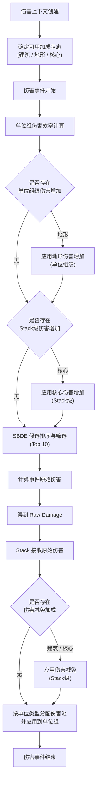

> **Notice**  
> This document is part of an independent, unofficial analysis of *Call of War* game mechanics.  
> Licensed under CC BY 4.0 unless otherwise noted.

## 概述

本文档介绍计算器中对`Call of War`中**部分**建筑和对应加成（包括核心）的模拟逻辑。
加成主要分为以下三种：
- **建筑加成** 仅提供`伤害减免`加成
- **地形加成** 仅提供`伤害增加`加成
- **核心加成** 提供`伤害减免`和`伤害增加`加成

> `核心加成`通常也被称为`家园加成`（Homeland Bonus），因其与`核心省份`（Core Province）绑定，本文档统一称为`核心加成`。
> 
> `伤害增加`加成通常也被称为`强度加成`（Strength Bonus），为避免引发歧义，本文档统一称为`伤害增加`加成。
> 
> `伤害减免`加成通常也被称为`防御值`（Protection），为避免和`反击伤害`（Defense）混淆（在中文语境中两者都可以翻译为防御），本文档统一称为`伤害减免`加成。

- `伤害增加`加成根据来源不同，生效层级可能为 `单位组`（如地形）或 `Stack`（如核心），其具体应用阶段在对应章节中分别说明。
- `伤害减免`加成生效层级为 `Stack`，相关计算在Stack受到伤害之后，按类型分配到各伤害池之前。
- 建筑、核心与地形加成在本文档中被建模为 伤害上下文级（Context-scoped）状态修正器，以上下文为作用域。
  
  它们的适用性在伤害上下文创建时确定，但其数值效果并不会在上下文级统一结算，而是根据加成类型，在每个具体的伤害事件中，于既定的计算阶段被实际应用。换言之，“Context-scoped”描述的是加成的**可用性范围**，而非其数值结算的时间点或并发语义。

**注意事项**：
- `伤害增加`加成的叠加方式是`乘算`。如一个Allies Doctrine的单位组位于核心省份的森林地块上，该单位组受到：
  - 15%的核心`伤害增加`
  - 20%的地形`伤害增加`

  i.e. 该单位组的总`伤害增加`加成为：
$$ 1.15_{\text{Homeland}} \times 1.2_{\text{Terrain}} = 1.38 $$
> *（Doctrine 在此仅作为示例标签，不参与任何加成判定）*
- `伤害减免`加成以**减免率**进行`加算`。  
  例如，一个 Allies Doctrine 的单位组位于核心省份中心，且该省份存在一个可用的 1 级堡垒（Bunkers），则该单位组获得：
  - 15% 的核心`伤害减免`
  - 15% 的建筑`伤害减免`

  总`伤害减免率`为：
$$ 0.15_{\text{Homeland}} + 0.15_{\text{Buildings}} = 0.30 $$

  对应的`最终承伤系数`为：
$$ 1 - 0.30 = 0.70 $$

> 上述加成的叠加方式与数值效果可通过游戏内 Army 面板直接观测，并在多次战斗测试中保持一致。本文档据此将其建模为线性乘算或加算规则，用于描述可观测的战斗结果。
>
> 需要注意的是，游戏内部的具体实现方式（例如是否存在中间取整、精度裁剪或数值缓存）并未公开，本文档所采用的表达式应被视为对实际行为的等效表示，而非对内部代码逻辑的直接复现。

## 建筑（Buildings）

> 在本计算器中，仅对定义了 `mitigation` 的建筑进行建模，用于模拟游戏中的 Bunkers 与 Fortification 所提供的伤害减免效果。其他仅影响生产或移动的建筑不参与战斗结算。

### 生效条件与作用域

建筑加成的生效需同时满足以下条件 [⁷](6.%20%E5%8F%82%E8%80%83.md#⁷)：

- 军队位于省份中心
- 省份由自己或友方国家控制（外交关系为 `Right of Way` 及以上）

当上述条件满足时，建筑所提供的伤害减免被视为**伤害上下文级（Context-scoped）状态**，在该上下文中的所有伤害事件中均可生效。

---

### 建筑伤害减免模型

建筑为防守方Stack提供针对**所有伤害类型**的百分比减免，其效果在伤害应用阶段体现为对最终伤害的削减：
$$ D_{\text{final}} = D_{\text{raw}} \times (1.0 - M_{\text{total}}) $$

其中：

- $D_{\text{raw}}$ 为未减免的原始伤害
- $M_{\text{total}}$ 为建筑所提供的总伤害减免率（`mitigation`）

> 本计算器允许在非标准防守语境下启用建筑加成，用于探索与验证不同战斗假设；该行为不应被视为对游戏默认规则的断言。

---

### 等级叠加与最大减免率

建筑的伤害减免率与生命值均按等级进行**层级式累加**。

以城市中的 Bunkers 为例：

- 1 级：提供 15% `mitigation`，HP = 40
- 2 级：提供 15% `mitigation`，HP = 80
- 3 级：提供 15% `mitigation`，HP = 120
- …

因此，一个 3 级 Bunkers 的总伤害减免率为：
$$ 0.15_{\text{Lvl1}} + 0.15_{\text{Lvl2}} + 0.15_{\text{Lvl3}} = 0.45 $$

对应的最大生命值为：
$$ 40_{\text{Lvl1}} + 80_{\text{Lvl2}} + 120_{\text{Lvl3}} = 240 $$

---

### 建筑生命值与减免效率

与单位组类似，建筑的实际伤害减免效果会随其当前生命值下降而线性衰减：
$$ M_{\text{level}} = M_{\text{max}} \times (0.2 + 0.8 \times R_{\text{hp}}) $$

其中：

- $M_{\text{max}}$ 为该等级建筑的最大减免率
- $R_{\text{hp}}$ 为当前等级建筑的剩余生命值比例

该模型反映了建筑在受损情况下仍保留最低防御能力的行为假设。

---

### 建筑失效规则（例外）

当建筑的当前生命值低于其 **1 级最大生命值** 时，该建筑将被视为**直接失效**，不再提供任何伤害减免。

例如：

- Bunkers 当前 HP = 39
- 1 级最大 HP = 40  

则该 Bunkers 在后续结算中不再生效。

---

### 建筑在伤害结算流程中的位置

建筑在每一次伤害事件中会受到对应的 `vs.Buildings` 类型伤害，但其生命值与状态的更新并不会立即影响当前上下文。

例如：

> 一个效率为 100% 的 1 级 Bunkers，在 `Round 1` 中即使承受了足以摧毁它的 `vs.Buildings` 伤害，仍可在该上下文内正常提供完整的伤害减免；其失效状态将在下一个伤害上下文中生效。

## 地形（Terrain）
### 生效条件与作用域

当地块的地形类型与单位类型匹配时，地形加成生效。  
地形判定基于伤害事件发生时 Stack 的当前位置，与目标位置或移动路径无关。

满足条件后，地形加成被视为伤害上下文级（Context-scoped）状态，在该上下文中的所有伤害事件中可被引用。

---

### 地形加成的单位差异

地形加成以单位组为粒度生效。同一 Stack 中，不同单位组可能因单位类型不同，对同一地形是否获得伤害增加加成存在差异。

地形加成不改变 Stack 的整体状态，而是直接修正候选单位组的有效伤害值。

与核心伤害增加不同，地形加成通过改变单位组的相对有效伤害值，可能间接改变 SBDE 的筛选结果。

---

### 地形加成与 SBDE 的关系

地形加成在单位组层级参与伤害计算，其效果在 SBDE 候选筛选之前生效。

因此，地形加成不仅影响最终伤害数值，还可能影响在一次伤害事件中被选入 SBDE（Top 10）的单位组集合。

---

### 地形加成在结算流程中的位置

地形伤害增加类加成在单位组伤害效率计算完成后立即应用，随后参与 SBDE 候选排序与筛选过程。

## 核心（Core）

### 生效条件与作用域

当军队所在省份为其所属**国家**的核心省份（Homeland Province）时，将触发核心加成。  
该判定仅依赖于 Stack 的当前位置，与 Doctrine、外交关系、攻击方向或进攻/防守身份无关。

满足条件后，核心加成被视为伤害上下文级（Context-scoped）状态，在该上下文中的所有伤害事件中统一生效。

---

### 核心提供的加成类型

核心可同时提供以下两类加成：

- **伤害增加**：以 Stack 为整体，对该 Stack 中所有单位的输出伤害施加统一比例修正  
- **伤害减免**：以 Stack 为整体，对该 Stack 承受的最终伤害施加统一比例削减

两类加成均不区分单位类型，也不影响 Stack 内部单位组之间的相对排序。

---

### 核心加成在结算流程中的位置

- 核心伤害增加作为 Stack 级的伤害增加修正，在该 Stack 参与的所有伤害事件中生效。

  > 在存在多个 Stack 同时参与同一 Damage Event 的情况下，
  该修正会作用于各单位组的有效伤害值，
  从而影响 SBDE（Top 10）的候选筛选结果。
  >
  > 当一个 Damage Event 中仅涉及单一 Stack 时，
  该修正可等效地视为 SBDE 之后的统一输出倍率，
  但该等效性不适用于 Army 层 SBDE 场景。

- 核心伤害减免在 Stack 接收原始伤害后、按单位类型分配至伤害池之前应用。

## 总结
伤害事件中，流程通常如下图所示：

## 加成系统的建模边界说明
### 关于 Storm（无视防御）属性的处理说明

部分单位（如 Commandos）在游戏内具有 `Storm` 属性，其描述为：

> *Storms fortifications and ignores the enemy defence bonus.*

从字面含义上，该属性通常被理解为：
在攻击时无视敌方的防御或伤害减免加成。

然而，截至本文档编写时，社区中尚缺乏足够的、可重复验证的测试结果，
以明确回答以下关键问题：

- Storm 是否仅作用于建筑类伤害减免，还是同时作用于核心加成？
- Storm 是以单位组为粒度生效，还是会影响整个伤害事件或 Stack？
- 当一个 Stack 中同时包含 Storm 与非 Storm 单位组时，
  其伤害是否会被拆分为“可减免 / 不可减免”两部分？
- Storm 是否仅在特定交战类型（如近战、进攻建筑）中生效？

由于上述行为在当前版本中表现为高度不透明（black-box），
且缺乏稳定的可观测证据支持任意一种明确的结算模型，
本计算器 **未对 Storm 属性引入任何特殊处理逻辑**。

在当前实现中：
- 所有单位的伤害均统一参与 Stack 级的伤害减免结算；
- Storm 属性不改变伤害结算流程中的任何阶段或顺序。

该决定并不意味着否认 Storm 属性在游戏中的存在或效果，
而是出于工程可验证性与模型一致性的考虑，
暂时将其视为 **已知但未建模（known but unmodeled）** 的特殊机制。

若未来社区能够提供足够的测试数据，
以明确 Storm 在混编 Stack、不同减免来源下的实际行为，
该部分模型可被单独扩展或参数化引入。

---

### 最后
建筑、地形与核心加成在计算器中的建模方式现在已经完整闭合。

需要强调的是，本模型并不尝试穷举或预测所有可能存在的隐藏修正，
而是围绕以下三个可观测且可复现的事实建立：

- 加成是否可用，在伤害上下文创建时确定；
- 加成的数值效果，在具体伤害事件的既定阶段被应用；
- 不同来源的加成通过固定的层级与顺序参与结算，其相对位置在多次测试中保持稳定。

在此框架下，计算器允许通过参数化方式启用或禁用特定加成，
以支持对极端情况、假设变体或未来版本行为的模拟与对比。
这些能力属于工具层面的扩展，不应被视为对游戏默认规则的断言。

本节所描述的加成系统，应被理解为：
一个能够解释并重现当前版本中大多数战斗数值表现的等效模型，
而非对 Call of War 内部实现细节的直接映射。

## NEXT PART

至此，计算器中所采用的主要战斗机制与加成规则已经全部介绍完毕。
前述各章节分别从单位、交战形态、伤害结算与加成系统等角度，
描述了这些机制**各自的定义、作用层级与生效阶段**。

然而，对于计算器或战斗模拟器的实际实现而言，
仅了解“有哪些规则”仍然是不够的。
更关键的问题在于：

> 在一次完整的战斗结算中，这些规则**以什么顺序**被触发、计算与应用？

为此，本文档在最后提供了一份独立的执行顺序说明，
用于将前述机制整合为一个可实现、可复现的结算流程。

➡ **[第七部分：Execution Order Summary（执行顺序总览）](7.%20Execution%20Order%20Summary.md)**

该部分不再引入新的战斗规则，
而是以实现视角，对已有机制的调用顺序、层级关系与数据流向进行总结说明，
可直接作为战斗模拟或计算器实现时的参考规格。
