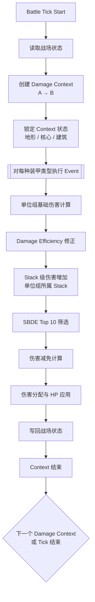

> **Notice**  
> This document is part of an independent, unofficial analysis of *Call of War* game mechanics.  
> Licensed under CC BY 4.0 unless otherwise noted.

## 概述

本部分旨在将前述各章节中已经定义完成的战斗机制，
整合为一套**线性、可实现、可复现**的结算顺序说明。

需要强调的是：

* 本部分**不引入任何新的战斗规则或数值假设**；
* 所有出现的概念、修正项与限制条件，均已在前文中定义；
* 本部分的目标是回答“**先做什么，后做什么**”，而不是“为什么要这样做”。

该执行顺序可直接作为 Battle Simulator 或数值计算器的实现参考。

---

## 7.1 执行层级概览

一次完整的交战结算，可被抽象为如下层级结构：

1. **Battle Tick（战斗周期）**
   游戏内部的离散结算单位（如近战每小时、远程每轮）。

2. **Damage Context（伤害上下文）**
   在一个 Tick 内，针对某一方向（攻击方 → 防御方）创建的结算上下文。

3. **Damage Event（伤害事件）**
   Damage Context 内部的最小结算单元，对应具体装甲类型的伤害计算与应用。

本部分将严格按照该层级，自外向内描述执行顺序。

---

## 7.2 Battle Tick 级流程

在一个 Battle Tick 开始时，执行以下步骤：

1. 读取当前战场状态（双方 Stack 组成、HP、所在省份等）。
2. 判定本 Tick 内需要创建的 Damage Context：

   * 近战：通常为单向，双边对称进攻交战状态为双向（A→B 与 B→A）。
   * 远程 / 空袭：通常为单向。
3. 按既定顺序（由游戏模式决定）**串行执行**各 Damage Context。

> 注意：
> Damage Context 在语义上可能被理解为“同时发生”，
> 但在实现层面必须视为**严格串行**。
> 前一个 Context 的结算结果会立即写回战场状态，
> 并影响后续 Context 的输入数据。

---

## 7.3 Damage Context 创建阶段

当一个 Damage Context 被创建时，需完成以下初始化步骤：

1. 确定攻击方 Stack 与防御方 Stack。
2. 锁定该 Context 可用的 **Context-scoped 状态**，包括但不限于：

   * 地形伤害增加是否适用；
   * 核心（Homeland / Core）加成是否适用；
   * 建筑减免是否具备生效条件。
3. 确定交战类型（近战 / 远程 / 空袭），用于后续装甲类型匹配。

上述状态一旦在 Context 创建时被锁定，
在该 Context 的整个生命周期内保持不变。

---

## 7.4 Damage Event 级执行顺序

在一个 Damage Context 内，针对每一种可被攻击的装甲类型，
依次执行一个 Damage Event。

每一个 Damage Event 的执行顺序如下：

### 7.4.1 基础伤害计算（单位组级）

1. 遍历攻击方 Stack 中所有可对该装甲类型造成伤害的单位组。
2. 对每个单位组：

   * 读取其基础攻击值；
   * 根据当前 HP 与最大 HP，计算 **Damage Efficiency**：
    $$ 
    Eff = 0.2 + 0.8 \times \frac{CurrentHP}{MaxHP} 
    $$
   * 应用单位组级的伤害增加（如地形加成）。
3. 得到该单位组对目标装甲类型的**有效伤害值**。

---

### 7.4.2 Stack 级伤害增加修正（预修正）

1. 在进入 SBDE 筛选之前，
   针对攻击方 Stack 中的**每一个单位组**，
   预先计算其可用的 Stack 级伤害增加修正（如核心伤害增加）。
2. 该修正仅取决于该单位组所属的 Stack 所处状态，
   不依赖于其它 Stack 的存在与否。
3. 预修正后的数值作为该单位组参与 SBDE 筛选时的有效伤害值之一部分。

---

### 7.4.3 SBDE（Top 10）筛选

1. 将所有候选单位组的**预修正后有效伤害值**汇总。
2. 针对当前装甲类型，选取 **有效伤害最高的 10 个单位组**。
3. 丢弃其余单位组在该 Damage Event 中的输出。

该步骤在 Army 层面生效，
Stack 拆分不会绕过该限制。

---

### 7.4.4 Raw Damage 汇总

- 将通过 SBDE 筛选的单位组伤害求和，得到 Raw Damage。

---

### 7.4.5 伤害减免与承伤系数计算

1. 汇总防御方 Stack 当前可用的所有伤害减免来源：

   * 建筑减免（若生效）；
   * 核心伤害减免（若生效）。
2. 将各减免率线性相加，得到总减免率：
   $M_{total} = \sum M_i$
3. 转换为承伤系数，并计算最终可分配伤害：
   $$ 
   D_{final} = D_{raw} \times (1 - M_{total}) 
   $$

---

### 7.4.6 伤害分配与应用

1. 根据目标 Stack 中各单位组的单位数量占比，进行伤害分池。
2. 将分配后的伤害应用至各单位组：

   * 扣减 HP；
   * 处理单位死亡、编制变化等状态更新。
3. 将结果**立即写回战场状态**。

Damage Event 至此结束。

---

## 7.5 Context 结束与状态写回

当一个 Damage Context 内的所有 Damage Event 执行完毕后：

1. Context 结束，不再保留任何中间状态。
2. 战场状态已被更新，可作为后续 Context 的输入。

随后进入下一个 Damage Context，
或结束本 Battle Tick。

---

## 7.6 整体执行流程图（概览）

以下流程图给出了从 Battle Tick 到 Damage Event 的整体执行关系，
用于快速理解各层级之间的调用顺序：

---

## 7.7 小结

通过以上执行顺序说明，
前文中定义的所有战斗机制被整合进一个明确的、线性的数据处理流程中。

该流程刻意避免对任何未充分验证的机制（如 Storm 属性）做出假设，
以保证模拟结果在已知规则范围内具有可复现性与可验证性。

至此，本文档的战斗结算建模部分全部完成。
