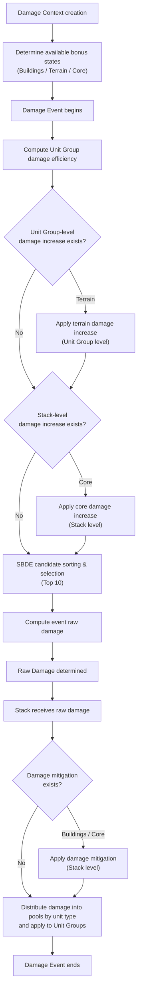

> **Notice**  
> This document is part of an independent, unofficial analysis of *Call of War* game mechanics.  
> Licensed under CC BY 4.0 unless otherwise noted.

## Overview

This document describes how the Calculator models **a subset** of buildings and their corresponding bonuses (including Core bonuses) in *Call of War*.

Bonuses are classified into three categories:

- **Building bonuses**: provide **damage mitigation only**
- **Terrain bonuses**: provide **damage increase only**
- **Core bonuses**: provide both **damage mitigation** and **damage increase**

> The *Core bonus* is also commonly referred to as the *Homeland Bonus*, as it is tied to *Core Provinces*.  
> For consistency, this document uses the term **Core bonus** throughout.
>
> *Damage increase* bonuses are sometimes referred to as *Strength Bonuses*.  
> To avoid ambiguity, this document consistently uses **damage increase**.
>
> *Damage mitigation* bonuses are sometimes referred to as *Protection*.  
> To avoid confusion with *retaliation damage* (Defense), which shares the same Chinese translation, this document consistently uses **damage mitigation**.

- Depending on their source, **damage increase** bonuses may apply at the **Unit Group level** (e.g. terrain) or the **Stack level** (e.g. core).  
  Their exact application stages are described in the corresponding sections.
- **Damage mitigation** bonuses always apply at the **Stack level**, and are evaluated **after a Stack receives raw damage but before damage is split into type-based damage pools**.
- Building, core, and terrain bonuses are modeled as **context-scoped state modifiers**, using the **Damage Context** as their scope.

  Their availability is determined when a Damage Context is created.  
  However, their numerical effects are *not* resolved uniformly at the context level.  
  Instead, depending on bonus type, they are applied at specific, predefined stages within each Damage Event.

  In other words, *“context-scoped”* describes the **scope of applicability**, not the timing or concurrency semantics of numerical resolution.

### Notes on stacking behavior

- **Damage increase** bonuses stack **multiplicatively**.  
  For example, if an Allies Doctrine Unit Group is located in a core province on a forest tile, it receives:
  - 15% Core damage increase
  - 20% Terrain damage increase

  The total damage increase multiplier is:
$$ 1.15_{\text{Core}} \times 1.2_{\text{Terrain}} = 1.38 $$

  > *Doctrine is used here purely as a label and does not participate in any bonus evaluation.*

- **Damage mitigation** bonuses stack **additively as mitigation rates**.  
  For example, if an Allies Doctrine Unit Group is located at the center of a core province containing an active level-1 Bunkers building, it receives:
  - 15% Core damage mitigation
  - 15% Building damage mitigation

  The total mitigation rate is:
$$ 0.15_{\text{Core}} + 0.15_{\text{Buildings}} = 0.30 $$

  The corresponding **final damage multiplier** is:
$$ 1 - 0.30 = 0.70 $$

> The stacking behavior and numerical effects described above are directly observable via the in-game Army panel and have remained consistent across repeated combat tests.  
> Accordingly, this document models them using linear multiplicative or additive rules to represent observable outcomes.
>
> The game’s internal implementation details (e.g. rounding, precision clipping, or caching) are not publicly documented.  
> All expressions used here should therefore be understood as **behaviorally equivalent models**, not as direct reproductions of internal code logic.

---

## Buildings

> In the Calculator, only buildings that define a `mitigation` attribute are modeled.  
> This is used to simulate the damage mitigation provided by **Bunkers** and **Fortifications**.  
> Buildings that only affect production or movement do not participate in combat resolution.

### Activation conditions and scope

Building bonuses become active only when **all** of the following conditions are satisfied [⁷](6.%20References.md#⁷):

- The army is located at the **province center**
- The province is controlled by the player or an allied country  
  (diplomatic status of *Right of Way* or higher)

When active, the damage mitigation provided by buildings is treated as a **context-scoped state**, available to all Damage Events within the same Damage Context.

---

### Building damage mitigation model

Buildings provide percentage-based mitigation against **all damage types** for the defending Stack.  
During damage application, this effect reduces final damage as follows:
$$ D_{\text{final}} = D_{\text{raw}} \times (1.0 - M_{\text{total}}) $$

Where:

- $D_{\text{raw}}$ is the unmitigated raw damage
- $M_{\text{total}}$ is the total mitigation rate provided by buildings

> The Calculator allows building bonuses to be enabled in non-standard defensive scenarios for the purpose of hypothesis testing and model exploration.  
> This behavior should not be interpreted as a claim about the game’s default rules.

---

### Level stacking and maximum mitigation

Both damage mitigation and hit points of buildings stack **cumulatively by level**.

Using Bunkers in a city as an example:

- Level 1: 15% mitigation, HP = 40
- Level 2: 15% mitigation, HP = 80
- Level 3: 15% mitigation, HP = 120
- …

Thus, a level-3 Bunkers provides a total mitigation rate of:
$$ 0.15_{\text{Lvl1}} + 0.15_{\text{Lvl2}} + 0.15_{\text{Lvl3}} = 0.45 $$

With a maximum HP of:
$$ 40_{\text{Lvl1}} + 80_{\text{Lvl2}} + 120_{\text{Lvl3}} = 240 $$

---

### Building HP and mitigation efficiency

Similar to Unit Groups, a building’s effective mitigation scales linearly with its current HP:
$$ M_{\text{level}} = M_{\text{max}} \times (0.2 + 0.8 \times R_{\text{hp}}) $$

Where:

- $M_{\text{max}}$ is the maximum mitigation rate at that building level
- $R_{\text{hp}}$ is the remaining HP ratio of that level

This model reflects the assumption that damaged buildings retain a minimal defensive capability.

---

### Building invalidation rule (exception)

When a building’s current HP falls **below the maximum HP of level 1**, the building is treated as **fully inactive** and provides no further damage mitigation.

Example:

- Current Bunkers HP = 39  
- Level-1 maximum HP = 40  

The Bunkers is considered inactive in subsequent resolutions.

---

### Building position in the damage resolution pipeline

Buildings can receive `vs.Buildings` damage during each Damage Event.  
However, updates to their HP and active/inactive state do **not** affect the current Damage Context.

For example:

> A fully effective level-1 Bunkers may receive enough `vs.Buildings` damage in *Round 1* to destroy it, yet still provide its full mitigation for all Damage Events within that same context.  
> Its inactive state only takes effect in the **next** Damage Context.

---

## Terrain

### Activation conditions and scope

Terrain bonuses apply when the terrain type of the tile matches the unit type.  
Terrain evaluation is based solely on the **Stack’s position at the moment the Damage Event occurs**, independent of the target position or movement path.

When active, terrain bonuses are treated as **context-scoped states**, available to all Damage Events within the Damage Context.

---

### Unit-specific effects of terrain bonuses

Terrain bonuses apply at the **Unit Group level**.  
Within the same Stack, different Unit Groups may or may not receive terrain-based damage increase depending on unit type.

Terrain bonuses do not modify the Stack as a whole.  
Instead, they directly adjust the **effective damage values of candidate Unit Groups**.

Unlike Core damage increase, terrain bonuses can indirectly affect SBDE selection by changing the relative effective damage ordering among Unit Groups.

---

### Relationship between terrain bonuses and SBDE

Terrain bonuses participate in damage computation at the Unit Group level and are applied **before SBDE candidate selection**.

As a result, terrain bonuses not only affect final damage output, but may also influence which Unit Groups are selected into the SBDE Top-10 set during a Damage Event.

---

### Terrain bonuses in the resolution pipeline

Terrain-based damage increase is applied immediately after Unit Group damage efficiency is computed, and before SBDE candidate sorting and selection.

---

## Core

### Activation conditions and scope

A Core bonus is activated when the Stack is located in a **Core Province of its owning nation** (Homeland Province).

This evaluation depends only on the Stack’s current position and is independent of Doctrine, diplomatic status, attack direction, or attacker/defender role.

When active, Core bonuses are treated as **context-scoped states**, applied uniformly across all Damage Events within the Damage Context.

---

### Bonus types provided by Core

A Core may provide both of the following bonuses:

- **Damage increase**:  
  A Stack-level modifier that uniformly scales the outgoing damage of all units in the Stack
- **Damage mitigation**:  
  A Stack-level modifier that uniformly reduces the final incoming damage received by the Stack

Neither bonus distinguishes between unit types, nor do they affect the relative ordering of Unit Groups within the Stack.

---

### Core bonuses in the resolution pipeline

- Core damage increase acts as a **Stack-level damage increase modifier**, active in all Damage Events involving the Stack.

  > When multiple Stacks participate in the same Damage Event,  
  this modifier affects the effective damage values of Unit Groups and may therefore influence SBDE (Top-10) candidate selection.
  >
  > When a Damage Event involves only a single Stack,  
  this modifier is mathematically equivalent to a uniform post-SBDE output multiplier.  
  This equivalence does **not** hold in Army-level SBDE scenarios.

- Core damage mitigation is applied **after the Stack receives raw damage and before damage is distributed into type-based damage pools**.

---

## Summary

Within a Damage Event, the resolution pipeline typically follows the structure shown below:

---

## Modeling boundaries of the bonus system

### Handling of the *Storm* attribute (ignores defense)

Some units (e.g. Commandos) possess the `Storm` attribute, described in-game as:

> *Storms fortifications and ignores the enemy defence bonus.*

At face value, this attribute is commonly interpreted as ignoring enemy defense or damage mitigation bonuses.

However, as of the time of writing, the community lacks sufficient **repeatable and verifiable test data** to conclusively answer the following questions:

* Does Storm apply only to building-based mitigation, or also to Core bonuses?
* Is Storm evaluated at the Unit Group level, or does it affect the entire Damage Event or Stack?
* In mixed Stacks containing both Storm and non-Storm Unit Groups,
  is damage split into “mitigable” and “non-mitigable” portions?
* Does Storm only apply in specific engagement types (e.g. melee, attacking buildings)?

Due to the highly opaque (black-box) behavior of this attribute and the absence of stable observable evidence supporting any single resolution model, **the Calculator does not implement any special handling for Storm**.

In the current implementation:

* All damage uniformly participates in Stack-level damage mitigation
* The Storm attribute does not alter any stage or ordering of the damage resolution pipeline

This decision does not deny the existence or in-game effect of Storm.
Rather, for reasons of engineering verifiability and model consistency, it is treated as a **known but unmodeled** special mechanism.

Should future community testing provide sufficient data to clarify Storm’s actual behavior—particularly in mixed Stacks and across different mitigation sources—this part of the model may be extended or parameterized independently.

---

## Final notes

With this section, the modeling of **buildings, terrain, and Core bonuses** in the Calculator is now complete.

It is important to emphasize that this model does not attempt to enumerate or predict every possible hidden modifier.
Instead, it is built around three observable and reproducible facts:

* Bonus availability is determined at Damage Context creation
* Bonus numerical effects are applied at predefined stages within Damage Events
* Bonuses from different sources participate in resolution through fixed layers and ordering, which remain stable across repeated tests

Within this framework, the Calculator allows specific bonuses to be enabled or disabled parametrically, supporting simulation and comparison of edge cases, hypothetical variants, or potential future behavior.
These capabilities belong to the **tooling layer** and should not be interpreted as assertions about the game’s default rules.

The bonus system described here should therefore be understood as an **equivalent model** capable of explaining and reproducing the majority of combat numerical behavior in the current version, rather than as a direct mapping of *Call of War*’s internal implementation.

---

## Next Part

At this point, all major combat mechanics and bonus rules used by the Calculator have been fully introduced.

The preceding sections described these mechanisms from the perspectives of units, engagement structures, damage resolution, and bonus systems—each in terms of **definition, scope, and application stage**.

For an actual calculator or combat simulator implementation, however, knowing *what* the rules are is not sufficient.
The more critical question is:

> In a complete combat resolution, **in what order** are these rules triggered, computed, and applied?

To answer this, the document concludes with an independent execution-order specification, which integrates the previously described mechanisms into a single, implementable resolution pipeline.

➡ **[Part VII: Execution Order Summary](7.%20Execution%20Order%20Summary%20(EN).md)**

This final section introduces no new combat rules.
Instead, it summarizes invocation order, layering, and data flow from an implementation perspective, and can be used directly as a reference specification for combat simulators or calculators.