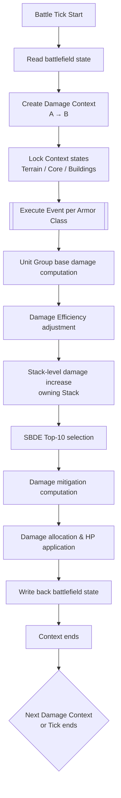

> **Notice**  
> This document is part of an independent, unofficial analysis of *Call of War* game mechanics.  
> Licensed under CC BY 4.0 unless otherwise noted.

## Overview

This section integrates the combat mechanisms defined in the preceding chapters into a **linear, implementable, and reproducible** execution order specification.

It is important to emphasize that:

- This section **introduces no new combat rules or numerical assumptions**;
- All concepts, modifiers, and constraints referenced here have already been defined earlier;
- The purpose of this section is to answer **“what happens first, and what happens next”**, not *why* the system behaves this way.

The execution order described here can be used directly as a reference for implementing a **Battle Simulator** or numerical **combat calculator**.

---

## 7.1 Execution Hierarchy Overview

A complete combat resolution can be abstracted into the following hierarchical structure:

1. **Battle Tick**  
   The discrete internal resolution unit used by the game  
   (e.g. hourly ticks for melee combat, round-based ticks for ranged combat).

2. **Damage Context**  
   A resolution context created within a Battle Tick for a specific direction  
   (**Attacker → Defender**).

3. **Damage Event**  
   The smallest resolution unit within a Damage Context, corresponding to damage
   computation and application against a specific **Armor Class**.

This section describes the execution order strictly following this hierarchy, from outer to inner layers.

---

## 7.2 Battle Tick–Level Flow

At the start of a Battle Tick, the following steps are executed:

1. Read the current battlefield state  
   (Stack composition, HP, province location, etc.).
2. Determine which Damage Contexts need to be created during this Tick:
   - **Melee combat**: usually unidirectional; bidirectional (A→B and B→A) in bilateral symmetric engagement states.
   - **Ranged / air strikes**: usually unidirectional.
3. Execute each Damage Context **serially**, in a predefined order determined by game mode.

> **Note**  
> Although Damage Contexts may be interpreted semantically as “simultaneous,”  
> they must be treated as **strictly serial** at the implementation level.  
> The result of each Context is written back to the battlefield state immediately  
> and affects the input conditions of subsequent Contexts.

---

## 7.3 Damage Context Creation Phase

When a Damage Context is created, the following initialization steps are performed:

1. Identify the attacking Stack and the defending Stack.
2. Lock all **context-scoped states** available to this Context, including but not limited to:
   - Whether terrain-based damage increase applies;
   - Whether Core (Homeland) bonuses apply;
   - Whether building-based damage mitigation conditions are satisfied.
3. Determine the engagement type (melee / ranged / air strike),  
   which will be used later for Armor Class matching.

Once these states are locked at Context creation time,  
they remain immutable throughout the entire lifetime of the Damage Context.

---

## 7.4 Damage Event–Level Execution Order

Within a Damage Context, a Damage Event is executed **once for each Armor Class**
that can be attacked.

Each Damage Event follows the execution order below.

---

### 7.4.1 Base Damage Computation (Unit Group Level)

1. Iterate over all Unit Groups in the attacking Stack that can deal damage to the current Armor Class.
2. For each Unit Group:
   - Read its base attack value;
   - Compute **Damage Efficiency** based on current and maximum HP:
$$ Eff = 0.2 + 0.8 \times \frac{CurrentHP}{MaxHP} $$
   - Apply Unit Group–level damage increase (e.g. terrain bonuses).
3. Obtain the Unit Group’s **effective damage value** against the target Armor Class.

---

### 7.4.2 Stack-Level Damage Increase (Pre-adjustment)

1. Before entering SBDE selection, compute the applicable **Stack-level damage increase**
   (e.g. Core damage increase) for **each Unit Group** in the attacking Stack.
2. This adjustment depends solely on the state of the Unit Group’s owning Stack,
   and does not depend on the presence of other Stacks.
3. The pre-adjusted value is treated as part of the Unit Group’s effective damage
   for SBDE candidate evaluation.

---

### 7.4.3 SBDE (Top-10) Selection

1. Collect the **pre-adjusted effective damage values** of all candidate Unit Groups.
2. For the current Armor Class, select the **10 Unit Groups with the highest effective damage**.
3. Discard the output of all remaining Unit Groups for this Damage Event.

This limitation applies at the **Army level**;  
splitting Stacks does not bypass the restriction.

---

### 7.4.4 Raw Damage Aggregation

- Sum the damage contributions of the Unit Groups selected by SBDE to obtain **Raw Damage**.

---

### 7.4.5 Damage Mitigation and Final Damage Coefficient

1. Collect all currently available damage mitigation sources for the defending Stack:
   - Building mitigation (if active);
   - Core damage mitigation (if active).
2. Linearly sum all mitigation rates to obtain the total mitigation:
$$ M_{total} = \sum M_i $$
3. Convert mitigation into a damage coefficient and compute final distributable damage:
$$ D_{final} = D_{raw} \times (1 - M_{total}) $$

---

### 7.4.6 Damage Allocation and Application

1. Split damage into pools based on the proportion of unit counts among Unit Groups in the target Stack.
2. Apply allocated damage to each Unit Group:
   - Reduce HP;
   - Process unit deaths, formation changes, and other state updates.
3. **Immediately write the results back to the battlefield state**.

The Damage Event ends here.

---

## 7.5 Context Completion and State Commit

After all Damage Events within a Damage Context have been executed:

1. The Context ends, and no intermediate state is retained.
2. The battlefield state has already been updated and can be used as input for subsequent Contexts.

Execution then proceeds to the next Damage Context,  
or the current Battle Tick ends.

---

## 7.6 Overall Execution Flow (Overview)

The following flowchart illustrates the overall execution relationship from
Battle Tick down to Damage Event, providing a high-level view of invocation order:

---

## 7.7 Summary

With the execution order defined above,
all combat mechanisms introduced in earlier sections are integrated into a clear,
linear data-processing pipeline.

This pipeline deliberately avoids making assumptions about any insufficiently verified mechanics
(such as the *Storm* attribute), ensuring that simulation results remain reproducible and verifiable
within the boundaries of known rules.

With this, the combat resolution modeling portion of this document is complete.
